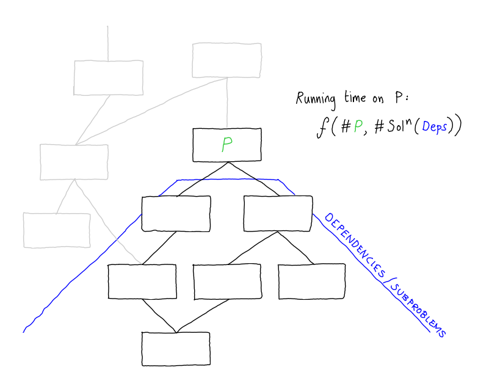

<script type="text/javascript" id="MathJax-script" async
  src="https://cdn.jsdelivr.net/npm/mathjax@3/es5/tex-mml-chtml.js">
</script>

<h1 style="margin-bottom:0px">Intensional Datatype Refinement:</h1>
<h2 style="margin-top:0px">With Application to Scalable Verification of Pattern-Matching Safety</h2>

*This is essentially the transcript of a talk I gave in the SIGPLAN track of PLDI'22 about my joint work with my former PhD student <a href="https://ec-jones.github.io/" target="_blank">Eddie Jones</a>, which had been published POPL'21.  The full paper is available [here](https://research-information.bris.ac.uk/files/265849562/3434336.pdf).*

In this work we wanted to create a new way to solve the pattern match safety problem.  This is, given a functional program, say a Haskell program, to verify that no execution of the program can trigger an inexhaustive match exception at runtime.  

Let me show you what I mean.  Consider a short program that transforms arbitrary propositional formulas into disjunctive normal form.

```haskell
  data Fm = 
      Lit L
      | Not Fm
      | And Fm Fm
      | Or Fm Fm
      | Imp Fm Fm
```

It will follow a standard strategy of first converting the formula into negation normal form (NNF) and then distributing the ands into the ors. 

The NNF transformation is given by a function `nnf`, which is accomplishing two goals - first pushing negations into the formula as deep as they will go - i.e. so that they only apply to propositional variables - and second eliminating derived operators like implication, so the result of nnf is a formula only containing ands, ors and literals.

```haskell
  nnf :: Fm -> Fm
  nnf (And p q) = And (nnf' p) (nnf' q)
  nnf (Or p q) = Or (nnf' p) (nnf' q)
  nnf (Imp p q) = Or (Not (nnf' p)) (nnf' q) 
  nnf (Not (Not p)) = nnf' p 
  nnf (Not (And p q)) = Or (nnf' (Not p)) (nnf' (Not q))
  nnf (Not (Or p q)) = And (nnf' (Not p)) (nnf' (Not q))
  nnf (Not (Imp p q)) = And (nnf' p) (nnf' (Not q))
  nnf (Not (Lit (Atom x))) = Lit (NegAtom x)
  nnf (Not (Lit (NegAtom x))) = Lit (Atom x)
  nnf (Lit (Atom x)) = Lit (Atom x)
  nnf (Lit (NegAtom x)) = Lit (NegAtom x)
```

Then `nnf2dnf` takes a formula involving only ands, ors and literals and just distributes the conjunctions into the disjunctions and writes the whole thing out as a list of lists.  

```haskell
  nnf2dnf (And p q) = distrib (nnf2dnf p) (nnf2dnf q)
  nnf2dnf (Or p q)  = List.union (nnf2dnf p) (nnf2dnf q)
  nnf2dnf (Lit a)   = [[a]]
```

Finally, we have this function `dnf`, which combines the two stages sequentially and, for the purpose of demonstration, we also ask `dnf` to parse a string representation of the formula as our starting point (not shown).

```haskell
  distrib xss yss = 
    List.nub [ List.union xs ys | xs <- xss, ys <- yss ]
  dnf = nnf2dnf . nnf . parseFm
```

So, if we load up GHCI, we can ask for e.g. 
  ```haskell 
  *Talk> dnf "P | Q"
  [[Atom 'P'], [Atom 'Q']]
  ```
  ```haskell 
  *Talk> dnf "P & Q"
  [[Atom 'P',Atom 'Q']]
  ```
  ```haskell
  *Talk> dnf "P & ~Q => R"
  *** Exception: app/Talk.hs:(42,1)-(44,25): 
        Non-exhaustive patterns in function nnf2dnf
  ```

This is exactly the kind of exception we are interested in preventing through program verification.  And what we have done in this work is to develop a new method that can prove, statically (i.e. at compile time), that a given functional program is free from match exceptions of this form.  We implemented it as a GHC plugin, so if you build this program with our plugin enabled, you get a warning of the following shape:
```Haskell
  Talk.hs:46:1-30: warning: [Intensional]  
    Could not verify that 'Not' from Talk.hs:30:20-32
      cannot reach the incomplete match at Talk.hs:(42,1)-(44,26)
```

The warning tells us that our tool was unable to prove that the `Not` created on line 29 does not, via a program execution, end up becoming the scrutinee of the the inexhaustive match spread over lines 40-42.  And, if we look at this line, indeed there is a bug because, although we are correctly eliminating the implication as a derived construct - i.e. replacing it by a disjunction in which the left disjunct is negated, we are not pushing this new negation into the formula.  We should have this right-hand-side instead: `Or (nnf (Not p)) (nnf q)` 

If we make the fix and compile this code again, there is no longer any warning, which means that our tool has successfully verified that no inexhaustive match exceptions can be thrown by this program.

## THE MOTIVATION

Now, I wanted to talk a little about why we were interested in contributing a solution to this problem, because it is actually a problem that has been solved many times before.   Of course, I use the term "solved" very loosely since the problem of verifying that a given program is free of inexhaustive match exceptions is obviously undecidable.  But there are many really quite ingenious approaches in the literature that each have their own advantages and disadvantages.

Our starting point was that none, or almost none of these approaches in the literature appear to be actually used in practice.  Why is that?  I believe it is because they are not *predictable*.  

As far as I know they all suffer from either:

  1. high worst-case complexity in terms of the size of the program (cubic, exponential or worse), or 
  2. no independent and understandable characterisation of expressive power.  

So 1 is perhaps clear, but maybe not 2.  Let me clarify.  Since the basic problem is undecidable, a sound and always terminating algorithm will only ever be able to correctly identify a subset of the problem instances.  In the case of verification problems, an algorithm will only ever be able to synthesize proofs for a subset of the programs.  Let us call this the domain of the algorithm.  As a user of this algorithm, someone who wants to use it to verify my program, ideally I want to have a good mental model about what is and what is not in the domain of the algorithm. 

Approaches to verification that suffer from either 1 or 2 are usually not predictable because when we push the GO button, we are reduced to just hoping for the best: maybe my program will be in the domain, or maybe it won't, maybe the tool will terminate within a reasonable length of time or maybe it will timeout.  And after a few too many negative experiences we don't want to use the tool any more.  In my opinion, calling such a piece of software a "tool" does a disservice to hammers and screwdrivers and electric saws whose applicability, whilst also limited, is characterised by a good mental model.

So, in this work our aim was to produce a system that both has a low worst-case complexity and also for which there is an independent (and easy to understand) characterisation of its power.  

Under reasonable assumptions, our *intensional refinements type system* is *linear in the size of the program* and it is characterised as an easy-to-understand extension of the ML type system.  It's so easy to understand I will describe the extension to you now.

Imagine that you take a program and in the program are defined some algebraic datatypes, such as the program above with its type of formulas `Fm`.  
  
  * First you take those datatypes and you systematically add to the program all (new) datatypes that can be obtained by erasing any subset of the constructors of the given ones.  So, if we go back to our previous example, we will add, for example, the type of clauses: 
  
    ```haskell
      Clause = Lit L | Or Clause Clause
    ```
    
    We will add, e.g. the type corresponding to simple types: 
    
    ```haskell
      SType = Lit L | Imp SType SType | And SType SType 
    ```

    Importantly for this example, we will add the type `AndOr` of formulas only involving `And` and `Or` (and literals). 
    
    ```haskell
      AndOr = Lit L | And AndOr AndOr | Or AndOr AndOr  
    ```
    
    and all the other possible types that arise by erasing some subset of constructors from the type `Fm`.  We call these the *intensional datatype refinements*, because they refine the original type `Fm` (by virtue of expressing smaller sets of values), but the refinement is determined completely by the intension of the type, the syntax of its definition.

  * Second, we disallow inexhaustive matches, with respect to this new set of types.  So in our system it is impossible to give `nnf2dnf` the type `Fm -> [[L]]` because the matching in `nnf2dnf` is not exhaustive wrt all values of type `Fm`.  

  * Thirdly, we relax the constraint that a top-level function has at most one typing.
  
Then a program is verifiable by our system, just if you can construct a typing for the functions built from this expanded stock of datatypes.  In this case, we expect this program to be verifiable because we should be able to type it as: `nnf: Fm -> AndOr` and `nnf2dnf : AndOr -> [[L]]`.  

## COMPLEXITY and COMPOSITIONALITY

I wanted to finish by saying something about how we achieve the linear time computational complexity, which I think is one of the most interesting features of the work.  It's interesting because it really leans heavily on the compositonality of the analysis, which I think is unusual because typically compositional approaches have either the same or worse worst-case complexity compared to a whole-program analysis.

If you imagine a dependency graph of a program, then the idea of a compositional approach is that we are going to analyse each component separately, starting from the bottom the graph, where we have procedures or functions with no dependency, and going up until we get to the root.  



At each node (procedure) P we will combine the *solutions* for the dependents with an analysis of the code of that procedure.  So, the time taken to analyse each procedure - each node of this dag - is some function of (a) the size of the actual code of the component and (b) the size of the solutions (result of analysing) of its dependencies.  But, in compositional program analyses, the size of the solutions is typically much larger than the size of the code contained in this tree.  For example, in frameworks that represent the analysis using simple constraint graphs, like the cubic-time fragment of set constraints, a procedure is represented by a graph that is linear in the size of the procedure, but the result of analysing this procedure is something close to the transitive closure of the graph and hence can be quadratic in the size of the procedure.  In many of the more complex analyses, the solution can be exponential in the size of the procedure.  

The key to obtaining our linear time complexity is our restriction to intensional refinement types, those that can be obtained by erasing some subset of the constructors of a given datatype.  This allows us to guarantee that the analysis results can be very compact - in fact of constant size (wrt to the program length), subject to two assumptions.  
  * The first assumption is the size of any given procedure is bounded by a constant, in other words we are assuming that, as programs get *arbitrarily* larger, their procedures do not.  So program size grows by adding more and more procedures, but no individual procedure is more than say 1 million lines.  

  * The second assumption is that the size of the types in the program is also bounded by a constant, i.e. that as programs get *arbitrarily* large, their types do not.

Our analysis, which is essentially a constraint solver, is actually computationally very expensive, and that's because our constraints are actually quite rich - technically our analysis is polyvariant and flow sensitive - and the solver takes time that is exponential in the number of constraint variables, but because we obtain compact, constant size solutions to the analysis of the dependencies of each procedure (and we assume that the size of a given procedure is constant size), we only ever call the constraint solver on constant size inputs.  

Thus we solve a small computationally hard constraint problem at every program point, rather than an enormous (exponential in the size of the program) constraint problem at the programs entry point.  

And, it works in practice: we have used the implementation I showed you at the start to analyse large 100-module packages from Hackage in less than a second.  You can obtain an implementation from <a href="https://github.com/plrg-bristol/intensional-datatys" target="_blank">GitHub</a>.


